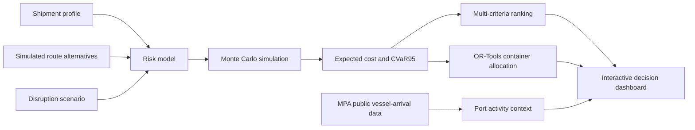

# HarborShield

**A risk-aware decision-support prototype for maritime cargo insurance and intermodal logistics.**

[](https://www.python.org/)
[](LICENSE)

HarborShield compares candidate cargo routes by combining shipment characteristics,
marine risk, insurance coverage, delay uncertainty, logistics cost, and carbon
emissions. It was designed as a transparent educational project at the intersection
of maritime technology, industrial systems engineering, supply-chain management,
and intelligent transportation.

## System overview



## Why this project exists

Freight forwarders and cargo owners make decisions under uncertainty: a cheaper
route may involve more transshipments, a longer voyage, higher congestion exposure,
or a larger expected loss. HarborShield turns these trade-offs into an auditable
scenario analysis instead of presenting a black-box recommendation.

## Current MVP

- Four disruption scenarios: normal operations, monsoon weather, port congestion,
  and strait disruption.
- Interpretable cargo-claim probability model.
- Reproducible Monte Carlo simulation of cargo loss and delays, including CVaR95 tail cost.
- Illustrative risk-based insurance premium and payout model.
- Multi-criteria route ranking across cost, risk, time, and carbon.
- Interactive dashboard, route map, cost breakdown, and CSV export.
- Cross-scenario stress testing, cost regret, and robust-route comparison.
- Risk-weight sensitivity analysis.
- OR-Tools integer optimisation for allocating container batches across routes.
- Official monthly vessel-arrival data from Singapore's MPA/data.gov.sg.
- Automated tests for monotonic risk behaviour, reproducibility, and ranking.

## Run locally

Python 3.9 or newer is recommended.

### macOS or Linux

```bash
python3 -m venv .venv
source .venv/bin/activate
python -m pip install -r requirements.txt
streamlit run app.py
```

### Windows PowerShell

```powershell
py -m venv .venv
.venv\Scripts\Activate.ps1
python -m pip install -r requirements.txt
streamlit run app.py
```

## Run the model tests

The core tests use only Python's standard library.

```bash
python -m unittest discover -s tests -v
```

## Project structure

```text
harborshield/
├── app.py                      # Streamlit interface
├── data/sample_routes.csv      # Clearly labelled simulated route inputs
├── data/mpa_vessel_arrivals_monthly.csv  # Official public-data snapshot
├── harborshield/models.py      # Risk, insurance, simulation, and ranking logic
├── harborshield/analysis.py    # Stress tests and sensitivity analysis
├── harborshield/optimization.py # OR-Tools container allocation
├── harborshield/public_data.py # Public-data provenance calculations
├── scripts/update_mpa_data.py  # Refresh official MPA data
├── tests/test_models.py        # Automated model tests
└── docs/
    ├── LEARNING_GUIDE_ZH.md    # Beginner-friendly learning path
    ├── APPLICATION_NOTES.md    # Application and interview positioning
    ├── METHODOLOGY.md          # Equations, assumptions, and validation
    ├── EXPERIMENT_REPORT.md    # Reproducible baseline results
    └── LITERATURE_AND_OPEN_SOURCE.md # Papers, repositories, and datasets
```

## Model boundaries and research integrity

The route values and coefficients in this MVP are simulated assumptions for
education and portfolio demonstration. They are **not** carrier quotations,
historical claims data, actuarial rates, or operational advice. A research-grade
extension should calibrate the model using licensed claims, weather, port-call,
congestion, and emissions data, then report uncertainty and validation results.

## Research and engineering notes

- [Methodology and equations](docs/METHODOLOGY.md)
- [Literature, open-source, and data traceability](docs/LITERATURE_AND_OPEN_SOURCE.md)
- [Baseline experiment report](docs/EXPERIMENT_REPORT.md)
- [Beginner learning guide in Chinese](docs/LEARNING_GUIDE_ZH.md)
- [Application positioning notes](docs/APPLICATION_NOTES.md)

## Planned extensions

1. Replace remaining simulated route values with traceable public datasets.
2. Add confidence intervals and convergence diagnostics.
3. Add AIS-derived port waiting times and berth-level validation.
4. Add marine-weather and land-side geospatial network analysis.
5. Validate assumptions through interviews with freight-forwarding practitioners.
