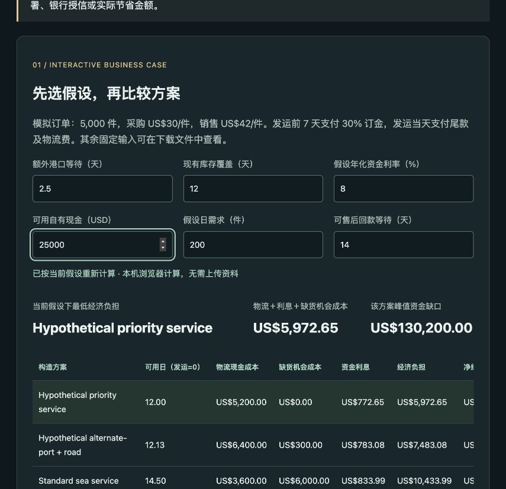
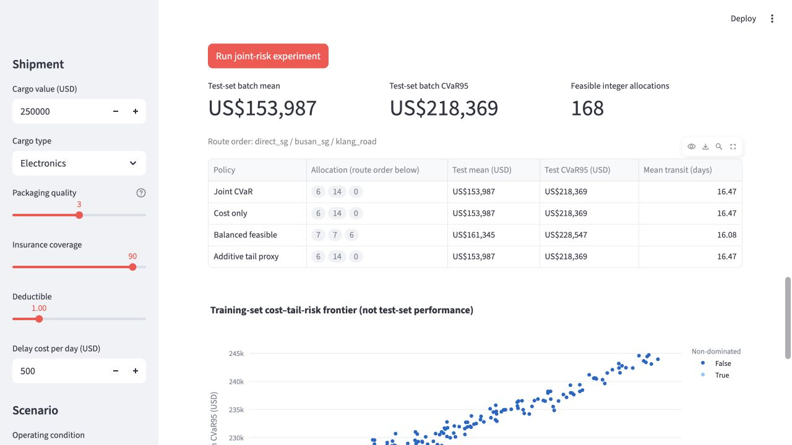
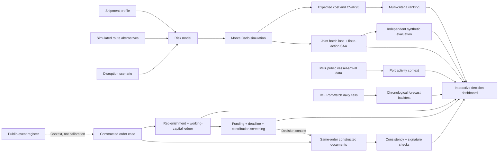

# HarborShield

**A risk-aware decision-support prototype for maritime cargo insurance and intermodal logistics.**

[](https://www.python.org/)
[](LICENSE)

**v0.5 real-data evidence:** 1,096 daily Singapore container-ship port-call
observations from IMF PortWatch (2022–2024), verified source snapshots and a
chronological forecast comparison. Train on 2022, select on 2023, test on 366
days in 2024. The selected previous-28-day mean has daily MAE **3.29 calls**,
versus **4.80** for yesterday's count (31.4% lower error on this snapshot).
It also beats the fixed ridge candidate; model complexity is not presumed superior.
[English evidence](https://sitorastudio.com/real-data-en.html) ·
[中文真实数据实验](https://sitorastudio.com/real-data.html) ·
[Measured report](docs/REAL_DATA_REPORT.md) ·
[小白复现指南](docs/REAL_DATA_GUIDE_ZH.md).

These are AIS-derived **activity** observations, not cargo-delay/claims labels.
The historical data were retrieved later and may be revised; this is not an
as-of-2024-vintage or live-deployment backtest. No forecast-to-delay conversion
or realised cost saving is claimed. Source data retain their
[IMF terms](data/portwatch/DATA_TERMS.md), separate from MIT-licensed code.

**v0.4:** a bilingual Singapore 2024 public-event case with constructed replenishment
economics, working-capital ledger, explicit funding/deadline/contribution screening
and same-order structured documents with DEMO Ed25519 signatures.
[English case calculator](https://sitorastudio.com/case-study-en.html) ·
[中文案例](https://sitorastudio.com/case-study.html) ·
[English project brief](docs/PROJECT_BRIEF_EN.md) ·
[Read the case and assumptions](docs/CASE_STUDY.md) ·
[单证实验指南](docs/TRADE_DOCUMENT_GUIDE_ZH.md).



The case screenshot shows constructed default order assumptions, not a real
customer transaction or bank financing offer.

**v0.2 research layer:** joint batch CVaR, common disruption shocks, independent synthetic
evaluation, four policy comparisons, confidence intervals and reproducible reports.
[Read the experiment evidence](docs/EXPERIMENT_REPORT.md).



The screenshot shows synthetic research inputs. The public portfolio hosts a
[static research evidence page](https://sitorastudio.com/experiment.html) and a
[browser-based order-economics calculator](https://sitorastudio.com/case-study-en.html).
The full Streamlit dashboard, document uploads and signing lab run locally unless
separately deployed on a Python host. The case page's document results are static snapshots.

HarborShield compares candidate cargo routes by combining shipment characteristics,
marine risk, insurance coverage, delay uncertainty, logistics cost, and carbon
emissions. It was designed as a transparent educational project at the intersection
of maritime technology, industrial systems engineering, supply-chain management,
and intelligent transportation.

## System overview



## Why this project exists

Freight forwarders and cargo owners make decisions under uncertainty: a cheaper
route may involve more transshipments, a longer voyage, higher congestion exposure,
or a larger expected loss. HarborShield turns these trade-offs into an auditable
scenario analysis instead of presenting a black-box recommendation.

## Current research prototype

- Real PortWatch activity forecast test with five methods and frozen chronological selection.
- Preserved raw API responses, source checksums, gap/duplicate/count validation and offline reproduction.
- Daily forecast errors, monthly diagnostics and bilingual public real-data evidence pages.
- Public Singapore 2024 event register, separately labelled constructed order/options.
- Replenishment, stockout opportunity cost and exact event-based working-capital ledger.
- Funding/deadline/contribution screening; no recommendation when no option is eligible.
- English and Chinese presentation from a shared template and calculator, preserving inputs on language switch.
- Interactive browser/Python calculations cross-checked across 27 sensitivity settings.
- Invoice, packing-list and insurance-application consistency checks on structured JSON.
- Ed25519 content-integrity demo with a separately supplied public-key anchor.
- Generated documents tied to the current constructed order, input digest and decision; invalid uploads block signing.
- Four disruption scenarios: normal operations, monsoon weather, port congestion,
  and strait disruption.
- Interpretable cargo-claim probability model.
- Reproducible Monte Carlo simulation of cargo loss and delays, including CVaR95 tail cost.
- Illustrative risk-based insurance premium and payout model.
- Multi-criteria route ranking across cost, risk, time, and carbon.
- Interactive dashboard, route map, cost breakdown, and CSV export.
- Cross-scenario stress testing, cost regret, and robust-route comparison.
- Risk-weight sensitivity analysis.
- Joint batch losses with correlated claims and shared sailing delays.
- Exact three-route sample-average allocation and cost–CVaR Pareto frontier.
- Independent 10,000-world synthetic evaluation against cost-only, balanced and additive-tail policies.
- Paired bootstrap intervals, five training seeds, dependence and sample-size diagnostics.
- OR-Tools integer allocation retained as a labelled additive-tail baseline.
- Insurance premium consistent with severity mean and deductible.
- Official monthly vessel-arrival data from Singapore's MPA/data.gov.sg.
- Automated tests for monotonic risk behaviour, reproducibility, and ranking.

## Run locally

Python 3.9 or newer is recommended.

### macOS or Linux

```bash
python3 -m venv .venv
source .venv/bin/activate
python -m pip install -r requirements.txt
streamlit run app.py
```

### Windows PowerShell

```powershell
py -m venv .venv
.venv\Scripts\Activate.ps1
python -m pip install -r requirements.txt
streamlit run app.py
```

## Run the model tests

Install the requirements first. Tests cover the model, joint samples, constraints,
CVaR identities and dashboard interactions.

```bash
python -m unittest discover -s tests -v
```

## Reproduce the research evidence

```bash
python -m pip install -r requirements-research.txt
python scripts/run_experiments.py
python scripts/run_case_study.py
python scripts/run_real_data.py
# Optional browser/Python agreement checks require Node.js 20+:
node scripts/test_case_calculator.cjs
```

This creates unrounded JSON, comparison CSV, Markdown and static HTML evidence
in `reports/`. The pinned file records tested top-level libraries, not a complete
transitive lock. Test worlds are never used for policy selection. Baselines may
coincide; superiority or real-world savings are not assumed. Cargo value and
costs are per container, not per batch.

The v0.4 deterministic case is separate from the claims simulation. Public facts
do not calibrate delay distributions or insurance/credit risk. All order prices,
service times, rates and document fixtures are constructed, not anonymised company
data. No real-world savings, bank integration, credit scoring, TradeTrust
interoperability or legally effective eBL/title transfer is claimed.

Local model and dashboard tests pass. A [CI template](ci/tests.yml.example)
is supplied, but GitHub Actions is **not yet enabled**: the current publishing
credential does not grant workflow modification. See [activation notes](ci/README.md).

The current verification run passes 92 Python tests, with separate JavaScript/Python
agreement checks for all 27 sensitivity settings, four constraint examples and
input boundaries. Strict YYYY-MM-DD document checks also pass on Python 3.12.
Financial purchase/sales values and purchase plus logistics are limited to 1e15
USD to match ledger event bounds; this numerical ceiling is not a realistic
transaction-size recommendation. Document amounts have a separate 1e12 limit.

## Project structure

```text
harborshield/
├── app.py                      # Streamlit interface
├── data/sample_routes.csv      # Clearly labelled simulated route inputs
├── data/mpa_vessel_arrivals_monthly.csv  # Official public-data snapshot
├── harborshield/models.py      # Risk, insurance, simulation, and ranking logic
├── harborshield/analysis.py    # Stress tests and sensitivity analysis
├── harborshield/optimization.py # OR-Tools container allocation
├── harborshield/joint_risk.py  # Shared shocks, exact SAA and held-out evaluation
├── harborshield/public_data.py # Public-data provenance calculations
├── scripts/update_mpa_data.py  # Refresh official MPA data
├── scripts/run_experiments.py # Reproduce the research evidence
├── reports/                   # JSON, CSV, Markdown and HTML artefacts
├── tests/test_models.py        # Automated model tests
└── docs/
    ├── LEARNING_GUIDE_ZH.md    # Beginner-friendly learning path
    ├── APPLICATION_NOTES.md    # Application and interview positioning
    ├── METHODOLOGY.md          # Equations, assumptions, and validation
    ├── EXPERIMENT_REPORT.md    # v0.2 synthetic evaluation evidence
    └── LITERATURE_AND_OPEN_SOURCE.md # Papers, repositories, and datasets
```

## Model boundaries and research integrity

The route values and coefficients in this MVP are simulated assumptions for
education and portfolio demonstration. They are **not** carrier quotations,
historical claims data, actuarial rates, or operational advice. A research-grade
extension should calibrate the model using licensed claims, weather, port-call,
congestion, and emissions data, then report uncertainty and validation results.

## Research and engineering notes

- [Methodology and equations](docs/METHODOLOGY.md)
- [Joint-risk methodology and evaluation](docs/JOINT_RISK_METHODOLOGY.md)
- [Literature, open-source, and data traceability](docs/LITERATURE_AND_OPEN_SOURCE.md)
- [Joint-risk experiment report](docs/EXPERIMENT_REPORT.md)
- [Beginner learning guide in Chinese](docs/LEARNING_GUIDE_ZH.md)
- [Project explanation in Chinese](docs/PROJECT_GUIDE_ZH.md)
- [Three hands-on case experiments to complete yourself](docs/CASE_WALKTHROUGH_ZH.md)
- [Application positioning notes](docs/APPLICATION_NOTES.md)

## Development transparency

This prototype was built with substantial AI-assisted coding and documentation.
It is a learning/research portfolio, not evidence of independently authored code
or calibrated operational expertise. Applicant claims should reflect work that
the owner can explain, reproduce and defend personally.

## Planned extensions

1. Replace remaining simulated route values with traceable public datasets.
2. Assess parameter uncertainty and distribution shift beyond simulation noise.
3. Add AIS-derived port waiting times and berth-level validation.
4. Add marine-weather and land-side geospatial network analysis.
5. Validate assumptions through interviews with freight-forwarding practitioners.
